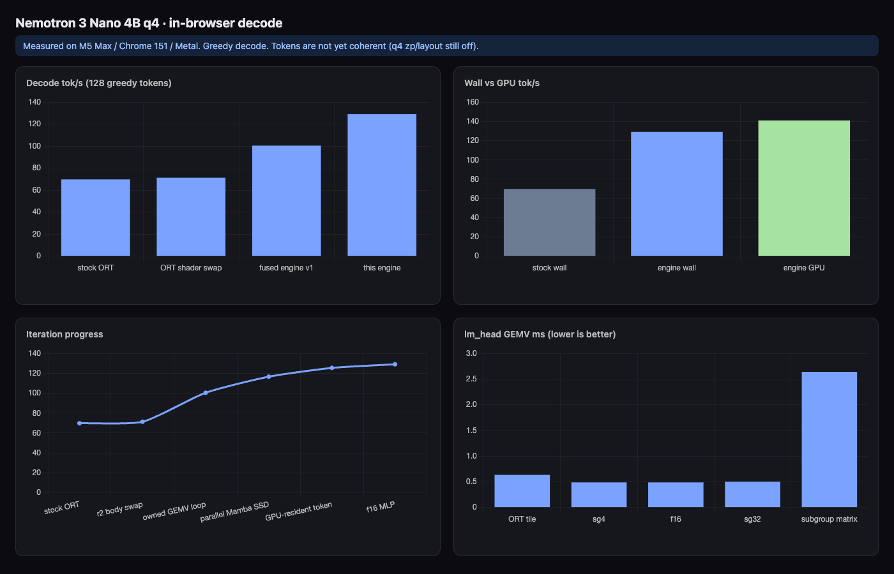

# Nemotron WebGPU Decode

From-scratch WebGPU decode for **Nemotron 3 Nano 4B q4** in Chrome.

Stock transformers.js + ONNX Runtime WebGPU is **70 tok/s** on an M5 Max.
With the instruct chat template (24 prompt tokens) plus 128 greedy tokens,
this engine is **115 tok/s** wall and **142 tok/s** on GPU timestamps
(1.64x stock). First greedy token id matches stock ORT. Generated text is
real language, not a run of newlines.

In-browser chat:
[ethanolivertroy/nemotron-3-nano-webgpu-kernels](https://huggingface.co/spaces/ethanolivertroy/nemotron-3-nano-webgpu-kernels).

Kernels and the decode engine were written by **Grok 4.6** in Cursor.

https://github.com/user-attachments/assets/3de8c1e7-9fb7-494a-92dc-dddf464361ab



The climb video uses the raw-encode iteration numbers. That run skipped the
chat template. The chat-template headline is 115 / 142.

## Measured (M5 Max, Chrome 151, Metal)

Gate prompt, chat template, 128 new tokens, greedy:

`tokenizer.apply_chat_template([{ role: 'user', content: 'Write a haiku about GPU kernels.' }], { add_generation_prompt: true })`

| Mode | tok/s | ms | notes |
|------|-------|-----|-------|
| stock ONNX Runtime | 69.76 | 1834.9 | transformers.js + ORT WebGPU |
| this engine (chat template) | **115.04** | 1112.7 | GPU 142 tok/s |
| this engine (GPU only) | 142.48 | 7.02 ms/step | timestamp queries |
| earlier raw 8-token encode | 129.11 | 991.4 | not the chat-template number |

Interactive charts: [charts/chart.html](charts/chart.html). Raw JSON:
[`harness/metal/m5max-decode-chat-template.json`](harness/metal/m5max-decode-chat-template.json).

A 3-4x like Gemma 4 E2B is not available on this model: Gemma 4 E2B is a
2.3B MoE, this Nano 4B hybrid runs every layer every token, and the vocab
is 131072.

## Run it

Needs Chrome with WebGPU, about 2.5 GB for the q4 weights, and a GPU that
can bind a 205 MB storage buffer (lm_head). The decode path uses the
`subgroups` feature.

```bash
npm install --ignore-scripts
node scripts/fetch-weights.mjs
npm run dev
```

Open:

- Chat: http://127.0.0.1:5173/
- Full-model decode bench: http://127.0.0.1:5173/bench/decode.html
- GEMV microbench: http://127.0.0.1:5173/bench/engine.html
- Charts: http://127.0.0.1:5173/charts/chart.html

Weights come from
[`onnx-community/NVIDIA-Nemotron-3-Nano-4B-BF16-ONNX`](https://huggingface.co/onnx-community/NVIDIA-Nemotron-3-Nano-4B-BF16-ONNX)
and are not in git. The fetch script puts `model_q4.onnx_data` and
`model_q4.onnx_data_1` in `harness/weights/`. The Space fetches those two
files from the Hub at runtime.

### Call the engine from your own page

`engine/runtime.js` owns the decode loop. It does not go through ONNX
Runtime. Tokenizer is the only `@huggingface/transformers` import.

```js
import { AutoTokenizer } from '@huggingface/transformers';
import { requestGpu } from './kernels/gpu.js';
import { DecodeEngine } from './engine/runtime.js';

const MODEL = 'onnx-community/NVIDIA-Nemotron-3-Nano-4B-BF16-ONNX';

const gpu = await requestGpu();
const tokenizer = await AutoTokenizer.from_pretrained(MODEL);
const engine = await DecodeEngine.create(gpu);

const promptIds = tokenizer.encode(
  tokenizer.apply_chat_template(
    [{ role: 'user', content: 'Write a haiku about GPU kernels.' }],
    { add_generation_prompt: true, tokenize: false },
  ),
  { add_special_tokens: false },
);

const outIds = [];
for await (const id of engine.generateStream(promptIds, { maxNew: 32 })) {
  outIds.push(id);
}
const text = tokenizer.decode(outIds, { skip_special_tokens: true });
```

`generate(promptIds, n)` is the bench path: one `mapAsync` at the end.
`generateStream()` copies each new id off GPU while the next token runs.

Headless:

```bash
CHROME_PATH="/Applications/Google Chrome.app/Contents/MacOS/Google Chrome" \
PORT=5179 PAGE_TIMEOUT_MS=2400000 \
CHROME_EXTRA_ARGS="--no-first-run --no-default-browser-check --disable-sync" \
node scripts/headless-bench.mjs --page decode --tokens 128 --angle metal \
  --profile-dir /tmp/nemotron-m5-chrome-profile
```

## What the engine does

- q4 GEMV, Mamba-2 decode SSD, GQA attention (no RoPE)
- MLP relu2 fused into the up-projection
- Prefill skips lm_head until the last prompt token
- Next token id stays on the GPU

```
engine/     decode runtime, weight loader, config
kernels/    WGSL
chat/       in-browser chat
bench/      decode.html and engine.html
charts/     measured tok/s
harness/    result JSON (weights are gitignored)
```

More numbers: [kernels/RESULTS.md](kernels/RESULTS.md).

Written by Grok 4.6. MIT license.
